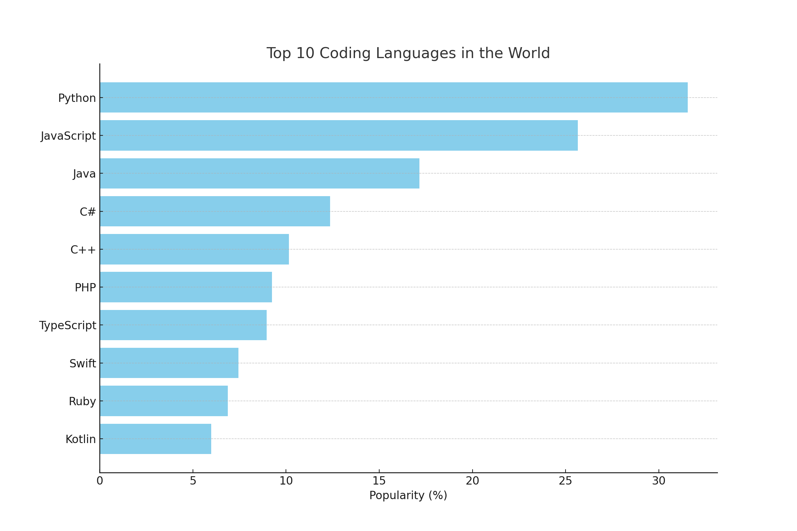

# Introduction
# Background
# Tools I used
# The Analysis
### 1. Top Paying Data Analyst Jobs
SQL queries? Check them out here: [project_sql folder](/project_sql/)
- **Coding Ex:**
```sql
SELECT
    job_id,
    job_title,
    job_location,
    job_schedule_type,
    salary_year_avg,
    job_posted_date :: DATE,
    name 
FROM
    job_postings_fact
LEFT JOIN company_dim
    ON job_postings_fact.company_id = company_dim.company_id

WHERE 
    job_title_short = 'Data Analyst' AND
    job_location = 'Anywhere' AND 
    salary_year_avg IS NOT NULL
ORDER BY
    salary_year_avg DESC
LIMIT 10
```

# What I Learned
# Conclusions
